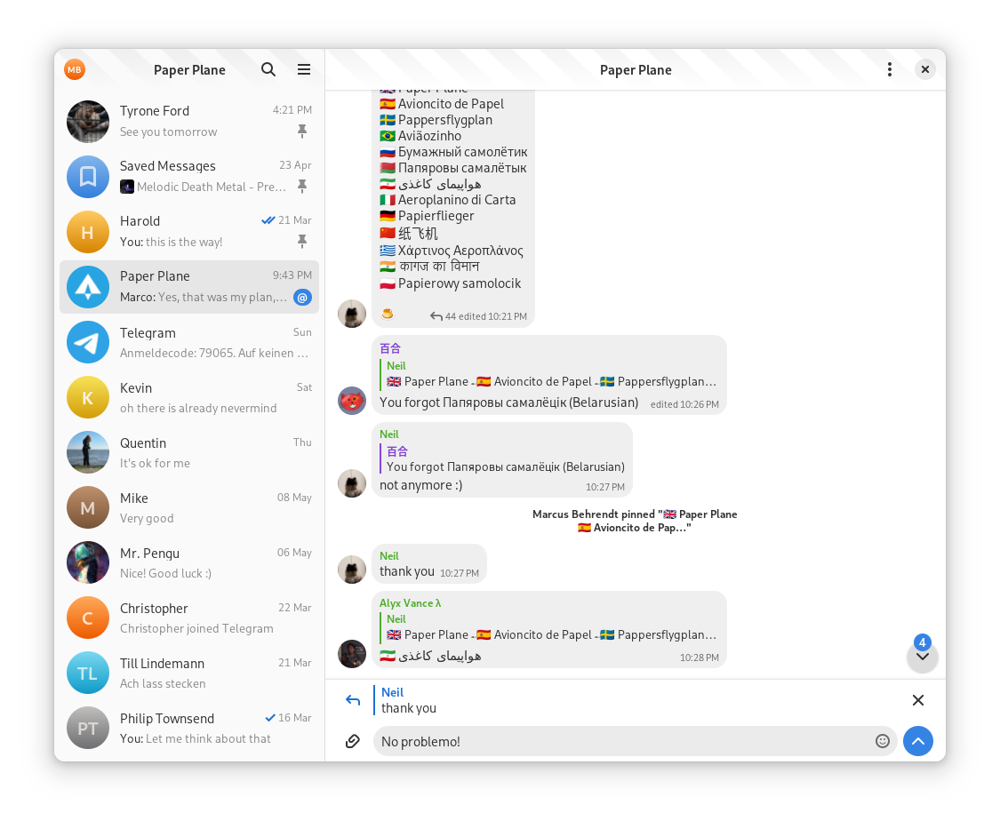

# GTK + Rust + Meson + Flatpak = <3

A boilerplate template to get started with GTK, Rust, Meson, Flatpak made for GNOME. It can be adapted for other desktop environments like elementary.

<div align="center">

</div>

## What does it contains?

- A simple window with a headerbar
- Bunch of useful files that you SHOULD ship with your application on Linux:
  - Metainfo: describe your application for the different application stores out there;
  - Desktop: the application launcher;
  - Icons: This repo contains three icons, a normal, a nightly & monochromatic icon (symbolic) per the GNOME HIG, exported using [App Icon Preview](https://flathub.org/apps/details/org.gnome.design.AppIconPreview).
- Flatpak Manifest for nightly builds
- Dual installation support
- Uses Meson for building the application
- Bundles the UI files & the CSS using gresources
- A pre-commit hook to run rustfmt on your code
- Tests to validate your Metainfo, Schemas & Desktop files
- Gsettings to store the window state, more settings could be added
- Gitlab CI to produce flatpak nightlies
- i18n support

## How to init a project ?

The template ships a simple python script to init a project easily. It asks you a few questions and replaces & renames all the necessary files.

The script requires having `git` installed on your system.

You can run it with,

```shell
python3 create-project.py
```

```shell
➜ python3 create-project.py
Welcome to GTK Rust Template
Name: Contrast
Project Name: contrast
Application ID (see: https://developer.gnome.org/ChooseApplicationID/): org.gnome.design.Contrast
Author: Bilal Elmoussaoui
Email: bil.elmoussaoui@gmail.com
Github/Gitlab repository: https://gitlab.gnome.org/World/design/contrast/
Use gtk4 [Y/n]: y
```

A new directory named `contrast` containing the generated project

## Building the project

Make sure you have `flatpak` and `flatpak-builder` installed. Then run the commands below. Replace `<application_id>` with the value you entered during project creation. Please note that these commands are just for demonstration purposes. Normally this would be handled by your IDE, such as GNOME Builder or VS Code with the Flatpak extension.

```
flatpak install org.gnome.Sdk//40 org.freedesktop.Sdk.Extension.rust-stable//20.08 org.gnome.Platform//40
flatpak-builder --user flatpak_app build-aux/<application_id>.Devel.json
```

## Running the project

Once the project is build, run the command below. Replace Replace `<application_id>` and `<project_name>` with the values you entered during project creation. Please note that these commands are just for demonstration purposes. Normally this would be handled by your IDE, such as GNOME Builder or VS Code with the Flatpak extension.

```
flatpak-builder --run flatpak_app build-aux/<application_id>.Devel.json <project_name>
```

## Credits

- [Podcasts](https://gitlab.gnome.org/World/podcasts)
- [Shortwave](https://gitlab.gnome.org/World/Shortwave)
